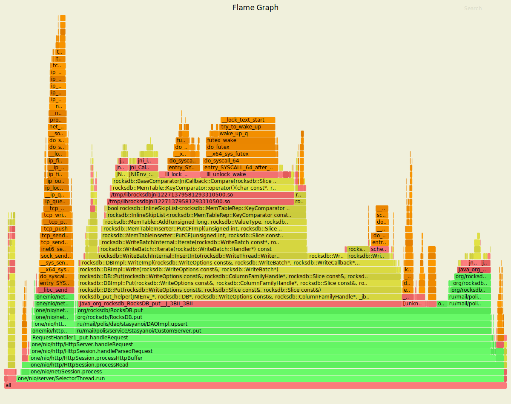
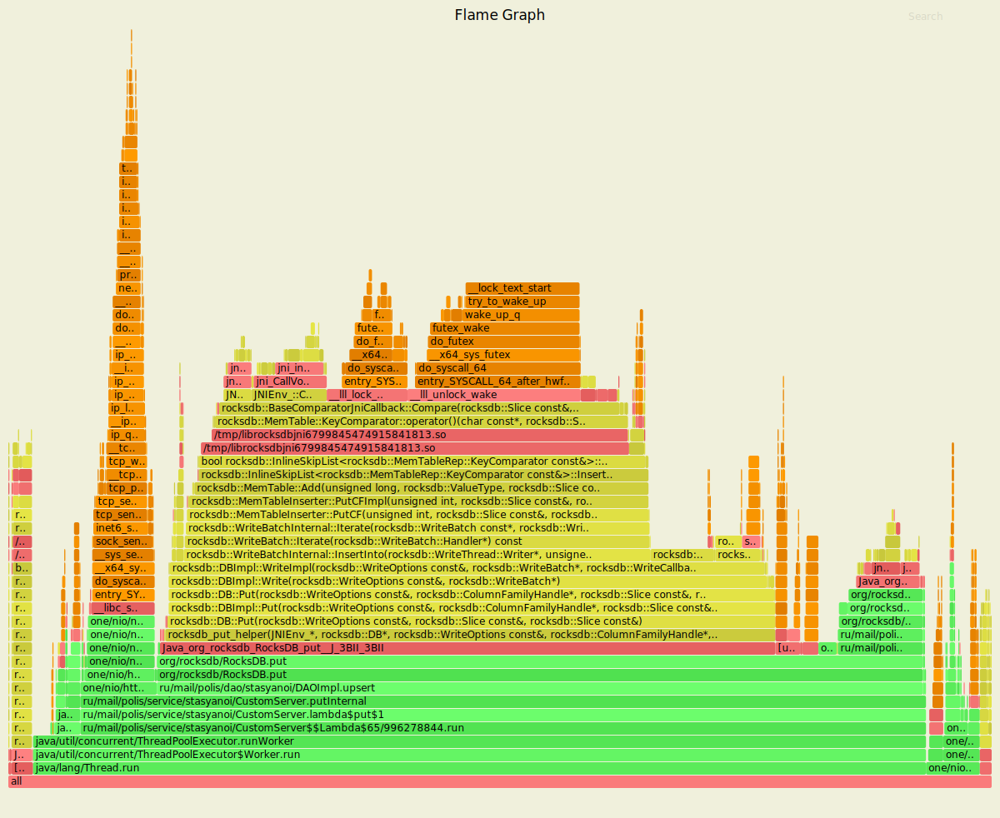
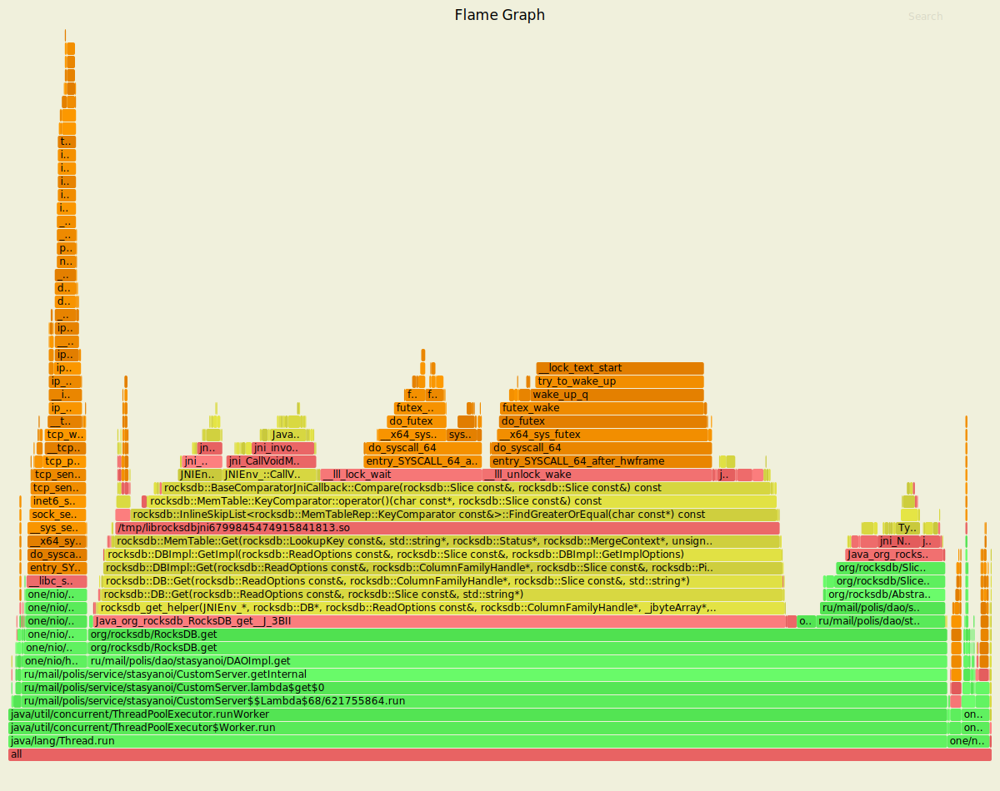

В рамках использования утилиты wrk2|profiler сервер имеет следующие показатели для put.
---------------------------------------------------------------------------------------

Скрипт PUT
----------------------------------------------------------------

rm wrkLogsPut.txt

../../wrk2/wrk -t1 -c65 -d15s -R2000 -s ../../wrk2/scripts/put.lua --u_latency http://localhost:8080 > wrkLogsPut.txt &

rm flamePutCpu.svg 

rm flamePutAlloc.svg 

rm flamePutLock.svg 

../../async-profiler-1.8.1-linux-x64/profiler.sh -d 5 -e cpu -f flamePutCpu.svg $(lsof -t -i :8080 -s TCP:LISTEN)

../../async-profiler-1.8.1-linux-x64/profiler.sh -d 5 -e alloc -f flamePutAlloc.svg $(lsof -t -i :8080 -s TCP:LISTEN)

../../async-profiler-1.8.1-linux-x64/profiler.sh -d 5 -e lock -f flamePutLock.svg $(lsof -t -i :8080 -s TCP:LISTEN)

SYNCHRONOUS 
-----------
Running 15s test @ http://localhost:8080
  
  1 threads and 65 connections
  
  Thread calibration: mean lat.: 3.774ms, rate sampling interval: 13ms
   
    Thread Stats   Avg      Stdev     Max   +/- Stdev
 
    Latency     4.67ms    2.54ms  14.96ms   66.55%
    Req/Sec     2.09k     2.01k    5.42k    42.30%
 
  Latency Distribution (HdrHistogram - Recorded Latency)
 
    50.000%    4.39ms
    75.000%    6.38ms
    90.000%    8.05ms
    99.000%    11.44ms
    99.900%    13.90ms
    99.990%    14.95ms
    99.999%    14.97ms
    100.000%   14.97ms

----------------------------------------------------------------
CPU put SYNC 
----------------------------------------------------

------------------------------------------------------
ALLOC put SYNC
----------------------------------------------------

LOCK put SYNC
----------------------------------------------------

ASYNCHRONOUS 
-----------    
 
Running 15s test @ http://localhost:8080
  
  1 threads and 65 connections
  
  Thread calibration: mean lat.: 1.199ms, rate sampling interval: 10ms
  
  Thread Stats   Avg      Stdev     Max   +/- Stdev
  
    Latency     1.17ms  489.15us   2.99ms   63.84%
    Req/Sec     2.11k   162.53     2.78k    75.54%
  
  Latency Distribution (HdrHistogram - Recorded Latency)
 
    50.000%     1.14ms
    75.000%     1.53ms
    90.000%     1.83ms
    99.000%     2.27ms
    99.900%     2.75ms
    99.990%     2.93ms
    99.999%     2.99ms
    100.000%    2.99ms

----------------------------------------------------------------
CPU put ASYNC
----------------------------------------------------

------------------------------------------------------
ALLOC put ASYNC
----------------------------------------------------

LOCK put ASYNC
----------------------------------------------------

В рамках использования утилиты wrk2|profiler сервер имеет следующие показатели для get.
---------------------------------------------------------------------------------------

Скрипт GET
----------------------------------------------------------------

rm wrkLogsGet.txt

../../wrk2/wrk -t1 -c65 -d15s -R2000 -s ../../wrk2/scripts/get.lua --u_latency http://localhost:8080 > wrkLogsGet.txt &

rm flameGetCpu.svg 

rm flameGetAlloc.svg  

rm flameGetLock.svg 

../../async-profiler-1.8.1-linux-x64/profiler.sh -d 5 -e cpu -f flameGetCpu.svg $(lsof -t -i :8080 -s TCP:LISTEN)

../../async-profiler-1.8.1-linux-x64/profiler.sh -d 5 -e alloc -f flameGetAlloc.svg $(lsof -t -i :8080 -s TCP:LISTEN)

../../async-profiler-1.8.1-linux-x64/profiler.sh -d 5 -e lock -f flameGetLock.svg $(lsof -t -i :8080 -s TCP:LISTEN)

SYNCHRONOUS
----------------------------------------------------------------------

Running 15s test @ http://localhost:8080

  1 threads and 65 connections

  Thread calibration: mean lat.: 3.685ms, rate sampling interval: 13ms

      Thread Stats   Avg      Stdev     Max   +/- Stdev
      Latency     4.38ms    2.77ms  15.19ms   68.96%
      Req/Sec     2.09k     2.01k    5.42k    43.85%
 
  Latency Distribution (HdrHistogram - Recorded Latency)
    
    50.000%    3.95ms
    75.000%    5.99ms
    90.000%    8.30ms
    99.000%    12.20ms
    99.900%    14.42ms
    99.990%    15.14ms
    99.999%    15.20ms
    100.000%   15.20ms

----------------------------------------------------------------
CPU get SYNC
----------------------------------------------------

------------------------------------------------------
ALLOC get SYNC
----------------------------------------------------

LOCK get SYNC
----------------------------------------------------

ASYNCHRONOUS
----------------------------------------------------------------------

Running 15s test @ http://localhost:8080

  1 threads and 65 connections

  Thread calibration: mean lat.: 4.150ms, rate sampling interval: 13ms

      Thread Stats   Avg      Stdev     Max   +/- Stdev
      Latency     4.51ms    2.11ms  12.18ms   64.40%
      Req/Sec     2.09k     1.97k    5.42k    45.38%

  Latency Distribution (HdrHistogram - Recorded Latency)

    50.000%    4.41ms
    75.000%    6.00ms
    90.000%    7.36ms
    99.000%    9.53ms
    99.900%    10.87ms
    99.990%    11.94ms
    99.999%    12.19ms
    100.000%   12.19ms

----------------------------------------------------------------
CPU get ASYNC
----------------------------------------------------

------------------------------------------------------
ALLOC get ASYNC
----------------------------------------------------

LOCK get ASYNC
----------------------------------------------------

Вывод:

В рамках нагрузочного тестирования для PUT/GET

№1 Потоков - 1 

№2 Соединений - 65

№3 Продолжительность - 15 секунд

№4 Количество запросов (Rate) - 2000

1) Put

SYNC

 Latency -> Avg. 4.67ms | Max. 14.96ms

 Req/Sec -> Avg. 2.09k  | Max. 5.42k 

ASYNC

 Latency -> Avg. 1.17ms | Max. 2.99ms

 Req/Sec -> Avg. 2.11k  | Max. 2.78k
  

2) Get
 
SYNC

 Latency -> Avg. 4.38ms | Max. 15.19ms

 Req/Sec -> Avg. 2.09k  | Max. 5.42k 

ASYNC

 Latency -> Avg. 4.51ms | Max. 12.18ms

 Req/Sec -> Avg. 2.09k  | Max. 5.42k 
 
 
В случае c put асинхронная версия сервера показала большую скорость при обработке запросов.
Быстрее примерно в 3.5 - 4 раза. 
С get запросом не получается улучшить производительность ввиду того,
что реализация get требует блокирования всей операции.  Таким образом образуется 
бутылочное горлышко, через которое может пройти только 1 запрос
  

В рамках графов CPU асинхронных запросов можно так же заметить, что запросы к 
хранилищу теперь делаются в рамках отдельного потока. Что отражает тот факт, 
что запросы теперь обрабатывается отдельным пулом потоков. 

График lock при синхронном и асинхронном put запросе так же отличаются. 
При синхронном запросе судя по графику, блокировка отсутствует.
При асинхронном запросе проявляется блокировка очереди задач
связанной с работой ExecutorService.   
 