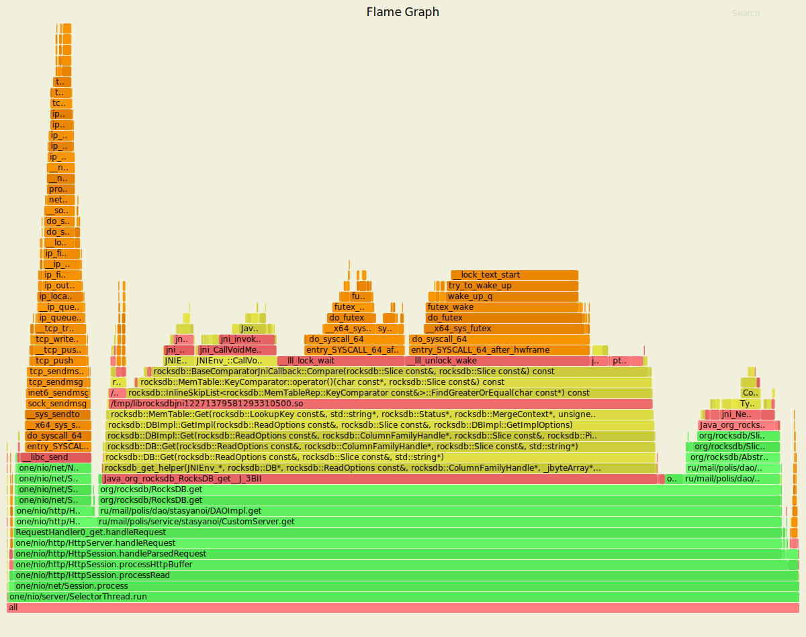

В рамках использования утилиты wrk2|profiler сервер имеет следующие показатели для put.
---------------------------------------------------------------------------------------

Скрипт PUT
----------------------------------------------------------------

rm wrkLogsPut.txt

rm flamePutCpu.svg 

rm flamePutAlloc.svg 

rm flamePutLock.svg 

../../wrk2/wrk -t1 -c65 -d25s -R6000 -s ../../wrk2/scripts/put.lua --u_latency http://localhost:8080 > wrkLogsPut.txt &

sleep 5s

echo "start analitics"

../../async-profiler-1.8.1-linux-x64/profiler.sh -d 5 -e cpu -f flamePutCpu.svg $(lsof -t -i :8080 -s TCP:LISTEN)

../../async-profiler-1.8.1-linux-x64/profiler.sh -d 5 -e alloc -f flamePutAlloc.svg $(lsof -t -i :8080 -s TCP:LISTEN)

../../async-profiler-1.8.1-linux-x64/profiler.sh -d 5 -e lock -f flamePutLock.svg $(lsof -t -i :8080 -s TCP:LISTEN)

echo "end analitics"

SYNCHRONOUS 
-----------

Running 25s test @ http://localhost:8080
 
  1 threads and 65 connections
 
  Thread calibration: mean lat.: 5.147ms, rate sampling interval: 19ms
 
    Thread Stats   Avg      Stdev     Max   +/- Stdev
    Latency     6.14ms   14.44ms 203.01ms   93.19%
    Req/Sec     6.17k     1.02k   14.06k    86.48%
  
  Latency Distribution (HdrHistogram - Recorded Latency)
 
    50.000%    2.09ms
    75.000%    3.79ms
    90.000%    13.18ms
    99.000%    70.53ms
    99.900%   162.43ms
    99.990%   193.54ms
    99.999%   200.06ms
    100.000%  203.13ms

----------------------------------------------------------------
CPU put SYNC 
----------------------------------------------------

------------------------------------------------------
ALLOC put SYNC
----------------------------------------------------

----------------------------------------------------
LOCK put SYNC
----------------------------------------------------

----------------------------------------------------

ASYNCHRONOUS 
-----------    
 
Running 25s test @ http://localhost:8080
 
  1 threads and 65 connections
 
  Thread calibration: mean lat.: 14.468ms, rate sampling interval: 97ms
 
  Thread Stats   Avg      Stdev     Max   +/- Stdev
 
    Latency    12.20ms   25.84ms 151.42ms   90.21%
    Req/Sec     6.04k     0.90k   10.75k    84.77%
 
  Latency Distribution (HdrHistogram - Recorded Latency)
    
    50.000%    2.28ms
    75.000%    7.73ms
    90.000%   36.51ms
    99.000%   125.44ms
    99.900%   142.98ms
    99.990%   148.35ms
    99.999%   151.04ms
    100.000%  151.55ms

----------------------------------------------------------------
CPU put ASYNC
----------------------------------------------------

------------------------------------------------------
ALLOC put ASYNC
----------------------------------------------------

LOCK put ASYNC
----------------------------------------------------

В рамках использования утилиты wrk2|profiler сервер имеет следующие показатели для get.
---------------------------------------------------------------------------------------

Скрипт GET
----------------------------------------------------------------

rm wrkLogsGet.txt

rm flameGetCpu.svg 

rm flameGetAlloc.svg  

rm flameGetLock.svg 

../../wrk2/wrk -t1 -c65 -d25s -R6000 -s ../../wrk2/scripts/get.lua --u_latency http://localhost:8080 > wrkLogsGet.txt &

sleep 5s

echo "start analitics"

../../async-profiler-1.8.1-linux-x64/profiler.sh -d 5 -e cpu -f flameGetCpu.svg $(lsof -t -i :8080 -s TCP:LISTEN)

../../async-profiler-1.8.1-linux-x64/profiler.sh -d 5 -e alloc -f flameGetAlloc.svg $(lsof -t -i :8080 -s TCP:LISTEN)

../../async-profiler-1.8.1-linux-x64/profiler.sh -d 5 -e lock -f flameGetLock.svg $(lsof -t -i :8080 -s TCP:LISTEN)

echo "end analitics"

SYNCHRONOUS
----------------------------------------------------------------------

Running 25s test @ http://localhost:8080
 
  1 threads and 65 connections
 
  Thread calibration: mean lat.: 7.614ms, rate sampling interval: 35ms
 
    Thread Stats   Avg      Stdev     Max   +/- Stdev
    Latency    12.49ms   33.05ms 455.94ms   93.16%
    Req/Sec     6.08k     1.02k   14.09k    85.17%
  
  Latency Distribution (HdrHistogram - Recorded Latency)
    
    50.000%    2.36ms
    75.000%    7.24ms
    90.000%   31.58ms
    99.000%   173.95ms
    99.900%   369.92ms
    99.990%   445.70ms
    99.999%   455.93ms
    100.000%  456.19ms

----------------------------------------------------------------
CPU get SYNC
----------------------------------------------------

------------------------------------------------------
ALLOC get SYNC
----------------------------------------------------

LOCK get SYNC
----------------------------------------------------

ASYNCHRONOUS
----------------------------------------------------------------------

Running 25s test @ http://localhost:8080

  1 threads and 65 connections

  Thread calibration: mean lat.: 23.370ms, rate sampling interval: 208ms

    Thread Stats   Avg      Stdev     Max   +/- Stdev
    Latency     4.71ms    8.26ms  95.42ms   92.31%
    Req/Sec     6.01k   208.25     6.76k    82.86%
  
  Latency Distribution (HdrHistogram - Recorded Latency)

     50.000%    2.22ms
    75.000%    3.65ms
    90.000%    9.75ms
    99.000%    45.31ms
    99.900%    76.35ms
    99.990%    90.69ms
    99.999%    93.76ms
    100.000%   95.49ms

----------------------------------------------------------------
CPU get ASYNC
----------------------------------------------------

------------------------------------------------------
ALLOC get ASYNC
----------------------------------------------------

----------------------------------------------------
LOCK get ASYNC
----------------------------------------------------

Вывод:

В рамках нагрузочного тестирования для PUT/GET

№1 Потоков - 1 

№2 Соединений - 65

№3 Продолжительность - 25 секунд

№4 Количество запросов (Rate) - 6000

1) Put

SYNC

 Latency -> Avg. 6.14ms | Max. 203.01ms

 Req/Sec -> Avg. 6.17k  | Max. 14.06k 

ASYNC

 Latency -> Avg. 12.20ms | Max. 151.42ms

 Req/Sec -> Avg. 6.04k  | Max. 10.75k
  

2) Get
 
SYNC

 Latency -> Avg. 12.49ms | Max. 455.94ms

 Req/Sec -> Avg. 6.08k  | Max. 14.09k 

ASYNC

 Latency -> Avg. 4.71ms | Max. 95.42ms

 Req/Sec -> Avg. 6.01k  | Max. 6.76k 
 
 
В рамках графов CPU асинхронных запросов можно так же заметить, что запросы к 
хранилищу теперь делаются в рамках отдельного потока. Что отражает тот факт, 
что запросы теперь обрабатывается отдельным пулом потоков. 

График lock при синхронном и асинхронном put|get запросе так же отличаются. 
При синхронном запросе судя по графику, блокировка отсутствует.
При асинхронном запросе проявляется блокировка связанная 
с работой ExecutorService.   
 