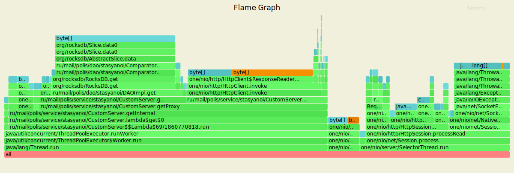

В рамках использования утилиты wrk2|profiler сервер имеет следующие показатели для put.
---------------------------------------------------------------------------------------

Running 50s test @ http://localhost:8080

  2 threads and 20 connections

  Thread calibration: mean lat.: 1.270ms, rate sampling interval: 10ms

  Thread calibration: mean lat.: 1.307ms, rate sampling interval: 10ms

    Thread Stats   Avg      Stdev     Max   +/- Stdev
    Latency     1.25ms  426.25us   3.52ms   66.81%
    Req/Sec   526.92     78.74     0.89k    71.86%
  
  Latency Distribution (HdrHistogram - Recorded Latency)
  
    50.000%     1.22ms
    75.000%     1.55ms
    90.000%     1.82ms
    99.000%     2.30ms
    99.900%     2.59ms
    99.990%     2.86ms
    99.999%     3.53ms
    100.000%    3.53ms
    
Скрипт PUT
----------------------------------------------------------------

rm wrkLogsPut1.txt

rm flamePutCpu1.svg 

rm flamePutAlloc1.svg 

rm flamePutLock1.svg

../../wrk2/wrk -c20 -d50s -R1000 -s ../../wrk2/scripts/put.lua --u_latency http://localhost:8080 > wrkLogsPut1.txt &

sleep 10s

echo "start analitics"

../../async-profiler-1.8.1-linux-x64/profiler.sh -d 10 -e cpu -f flamePutCpu1.svg $(lsof -t -i :8080 -s TCP:LISTEN) 

../../async-profiler-1.8.1-linux-x64/profiler.sh -d 10 -e alloc -f flamePutAlloc1.svg $(lsof -t -i :8080 -s TCP:LISTEN) 

../../async-profiler-1.8.1-linux-x64/profiler.sh -d 10 -e lock -f flamePutLock1.svg $(lsof -t -i :8080 -s TCP:LISTEN)

echo "end analitics"

sleep 10s

----------------------------------------------------------------
CPU put
----------------------------------------------------

------------------------------------------------------
ALLOC put
----------------------------------------------------

LOCK put
----------------------------------------------------

В рамках использования утилиты wrk2|profiler сервер имеет следующие показатели для get.
---------------------------------------------------------------------------------------

Running 50s test @ http://localhost:8080

  2 threads and 20 connections

  Thread calibration: mean lat.: 1.222ms, rate sampling interval: 10ms

  Thread calibration: mean lat.: 1.236ms, rate sampling interval: 10ms

    Thread Stats   Avg      Stdev     Max   +/- Stdev

    Latency     1.25ms  444.71us   4.23ms   68.11%
    Req/Sec   528.07     82.27     0.89k    65.96%
  
  Latency Distribution (HdrHistogram - Recorded Latency)
  
    50.000%     1.23ms
    75.000%     1.54ms
    90.000%     1.84ms
    99.000%     2.42ms
    99.900%     2.72ms
    99.990%     3.28ms
    99.999%     4.24ms
    100.000%    4.24ms

Скрипт GET
----------------------------------------------------------------

rm wrkLogsGet1.txt

rm flameGetCpu1.svg 

rm flameGetAlloc1.svg  

rm flameGetLock1.svg 

../../wrk2/wrk -c20 -d50s -R1000 -s ../../wrk2/scripts/get.lua --u_latency http://localhost:8080 > wrkLogsGet1.txt &

sleep 10s

echo "start analitics"

../../async-profiler-1.8.1-linux-x64/profiler.sh -d 10 -e cpu -f flameGetCpu1.svg $(lsof -t -i :8080 -s TCP:LISTEN) 

../../async-profiler-1.8.1-linux-x64/profiler.sh -d 10 -e alloc -f flameGetAlloc1.svg $(lsof -t -i :8080 -s TCP:LISTEN) 

../../async-profiler-1.8.1-linux-x64/profiler.sh -d 10 -e lock -f flameGetLock1.svg $(lsof -t -i :8080 -s TCP:LISTEN) 

echo "end analitics"

----------------------------------------------------------------
CPU get
----------------------------------------------------

------------------------------------------------------
ALLOC get
----------------------------------------------------

LOCK get
----------------------------------------------------

Вывод:

В рамках нагрузочного тестирования для PUT/GET

№1 Соединений - 20

№2 Продолжительность - 50 секунд

№3 Количество запросов (Rate) - 1000

1) Put

    
     Latency     1.25ms  426.25us   3.52ms   66.81%
     Req/Sec   526.92     78.74     0.89k    71.86%

2) Get

    Latency     1.25ms  444.71us   4.23ms   68.11%
    Req/Sec   528.07     82.27     0.89k    65.96%
 
На снимках работы CPU можно видеть переадресовку 
запросов на другие сервисы через HttpClient. 
Причем GET запросы выполняются c со скоростью, равной скорости обработки PUT запросов.
Работа проходит в 3-10 раз быстрее по сравнению с реализацией на 3-м этапе из-за того, что нагрузка на 4-м
этапе была специально уменьшена для выполнения эксперимента.

Результаты 3-го этапа для сравнения:

1) Put

SYNC

     Latency -> Avg. 6.14ms | Max. 203.01ms
     Req/Sec -> Avg. 6.17k  | Max. 14.06k 

ASYNC

 
    Latency -> Avg. 12.20ms | Max. 151.42ms
    Req/Sec -> Avg. 6.04k  | Max. 10.75k
  

2) Get
 
SYNC

    Latency -> Avg. 12.49ms | Max. 455.94ms
    Req/Sec -> Avg. 6.08k  | Max. 14.09k 

ASYNC

    Latency -> Avg. 4.71ms | Max. 95.42ms
    Req/Sec -> Avg. 6.01k  | Max. 6.76k  

