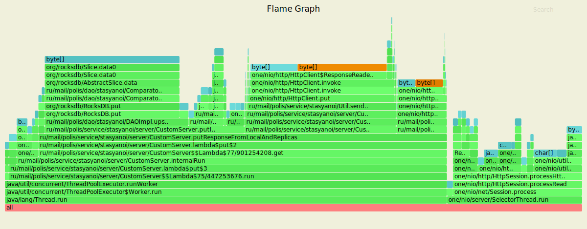
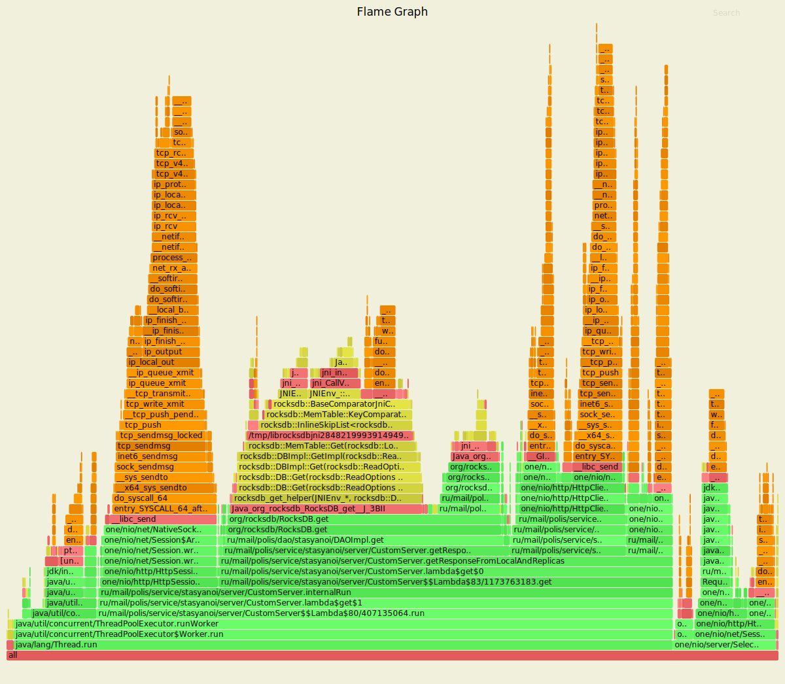

В рамках использования утилиты wrk2|profiler сервер имеет следующие показатели для put.
---------------------------------------------------------------------------------------

Running 50s test @ http://localhost:8080
  
  2 threads and 20 connections
    
  Thread calibration: mean lat.: 2.032ms, rate sampling interval: 10ms
  
  Thread calibration: mean lat.: 2.035ms, rate sampling interval: 10ms
  
    Thread Stats   Avg      Stdev     Max   +/- Stdev
    Latency     2.19ms  546.41us  10.06ms   70.24%
    Req/Sec   526.23    107.73     0.89k    63.81%
  
  Latency Distribution (HdrHistogram - Recorded Latency)
    
    50.000%    2.20ms
    75.000%    2.54ms
    90.000%    2.84ms
    99.000%    3.39ms
    99.900%    5.49ms
    99.990%    7.50ms
    99.999%    10.07ms
    100.000%   10.07ms
    
Скрипт PUT
----------------------------------------------------------------

rm wrkLogsPut1.txt

rm flamePutCpu1.svg 

rm flamePutAlloc1.svg 

rm flamePutLock1.svg

../../wrk2/wrk -c20 -d50s -R1000 -s ../../wrk2/scripts/put.lua --u_latency http://localhost:8080 > wrkLogsPut1.txt &

sleep 10s

echo "start analitics"

../../async-profiler-1.8.1-linux-x64/profiler.sh -d 10 -e cpu -f flamePutCpu1.svg $(lsof -t -i :8080 -s TCP:LISTEN) 

../../async-profiler-1.8.1-linux-x64/profiler.sh -d 10 -e alloc -f flamePutAlloc1.svg $(lsof -t -i :8080 -s TCP:LISTEN) 

../../async-profiler-1.8.1-linux-x64/profiler.sh -d 10 -e lock -f flamePutLock1.svg $(lsof -t -i :8080 -s TCP:LISTEN)

echo "end analitics"

sleep 10s

----------------------------------------------------------------
CPU put
----------------------------------------------------

------------------------------------------------------
ALLOC put
----------------------------------------------------

LOCK put
----------------------------------------------------

В рамках использования утилиты wrk2|profiler сервер имеет следующие показатели для get.
---------------------------------------------------------------------------------------

Running 50s test @ http://localhost:8080

  2 threads and 20 connections

  Thread calibration: mean lat.: 1.939ms, rate sampling interval: 10ms

  Thread calibration: mean lat.: 1.849ms, rate sampling interval: 10ms

    Thread Stats   Avg      Stdev     Max   +/- Stdev
    Latency     2.05ms  514.49us  12.18ms   69.43%
    Req/Sec   526.51    115.72     0.90k    62.69%
  
  Latency Distribution (HdrHistogram - Recorded Latency)
    
    50.000%    2.03ms
    75.000%    2.38ms
    90.000%    2.70ms
    99.000%    3.28ms
    99.900%    4.12ms
    99.990%    9.01ms
    99.999%    12.18ms
    100.000%   12.18ms

Скрипт GET
----------------------------------------------------------------

rm wrkLogsGet1.txt

rm flameGetCpu1.svg 

rm flameGetAlloc1.svg  

rm flameGetLock1.svg 

../../wrk2/wrk -c20 -d50s -R1000 -s ../../wrk2/scripts/get.lua --u_latency http://localhost:8080 > wrkLogsGet1.txt &

sleep 10s

echo "start analitics"

../../async-profiler-1.8.1-linux-x64/profiler.sh -d 10 -e cpu -f flameGetCpu1.svg $(lsof -t -i :8080 -s TCP:LISTEN) 

../../async-profiler-1.8.1-linux-x64/profiler.sh -d 10 -e alloc -f flameGetAlloc1.svg $(lsof -t -i :8080 -s TCP:LISTEN) 

../../async-profiler-1.8.1-linux-x64/profiler.sh -d 10 -e lock -f flameGetLock1.svg $(lsof -t -i :8080 -s TCP:LISTEN) 

echo "end analitics"

----------------------------------------------------------------
CPU get
----------------------------------------------------

------------------------------------------------------
ALLOC get
----------------------------------------------------

LOCK get
----------------------------------------------------

Вывод:

В рамках нагрузочного тестирования для PUT/GET

№1 Потоков - 1 

№2 Соединений - 20

№3 Продолжительность - 50 секунд

№4 Количество запросов (Rate) - 1000

1) Put
   
   
    Latency    2.19ms  546.41us  10.06ms   70.24%
    Req/Sec   526.23    107.73     0.89k    63.81%

2) Get

    
    Latency    2.05ms  514.49us  12.18ms   69.43%
    Req/Sec   526.51    115.72     0.90k    62.69%
 

На SVG СPU можно заметить, что используются Helper классы для отправки на репликацию запросов. 
Ввиду появления логики репликации, скорость работы упала в 2 - 3 раза. 
Для сравнения представлены результаты профилирования с 4-го этапа. 

РЕЗУЛЬТАТЫ 4-ГО ЭТАПА:

1) Put

    
     Latency     1.25ms  426.25us   3.52ms   66.81%
     Req/Sec   526.92     78.74     0.89k    71.86%

2) Get

    Latency     1.25ms  444.71us   4.23ms   68.11%
    Req/Sec   528.07     82.27     0.89k    65.96%
 

