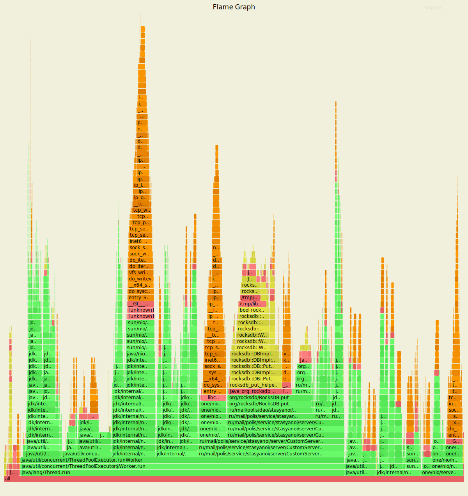
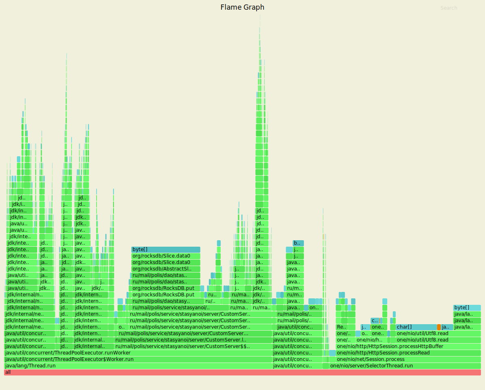
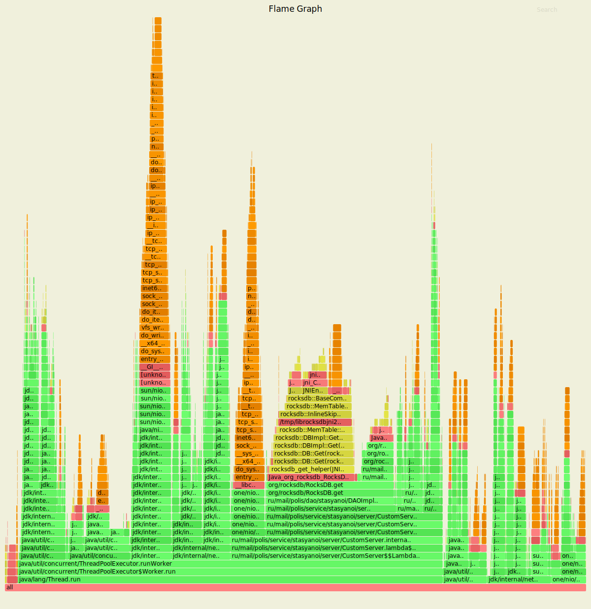
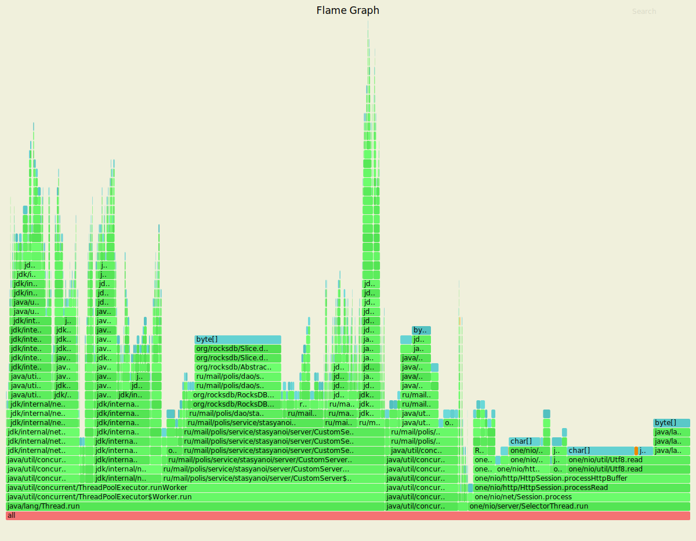

В рамках использования утилиты wrk2|profiler сервер имеет следующие показатели для put.
---------------------------------------------------------------------------------------
    
Скрипт PUT
----------------------------------------------------------------

rm wrkLogsPut1.txt

rm flamePutCpu1.svg 

rm flamePutAlloc1.svg 

rm flamePutLock1.svg

../../wrk2/wrk -c20 -d50s -R1000 -s ../../wrk2/scripts/put.lua --u_latency http://localhost:8080 > wrkLogsPut1.txt &

sleep 10s

echo "start analitics"

../../async-profiler-1.8.1-linux-x64/profiler.sh -d 10 -e cpu -f flamePutCpu1.svg $(lsof -t -i :8080 -s TCP:LISTEN) 

../../async-profiler-1.8.1-linux-x64/profiler.sh -d 10 -e alloc -f flamePutAlloc1.svg $(lsof -t -i :8080 -s TCP:LISTEN) 

../../async-profiler-1.8.1-linux-x64/profiler.sh -d 10 -e lock -f flamePutLock1.svg $(lsof -t -i :8080 -s TCP:LISTEN)

echo "end analitics"

sleep 10s

----------------------------------------------------------------
CPU put
----------------------------------------------------

------------------------------------------------------
ALLOC put
----------------------------------------------------

LOCK put
----------------------------------------------------

В рамках использования утилиты wrk2|profiler сервер имеет следующие показатели для get.
---------------------------------------------------------------------------------------

Скрипт GET
----------------------------------------------------------------

rm wrkLogsGet1.txt

rm flameGetCpu1.svg 

rm flameGetAlloc1.svg  

rm flameGetLock1.svg 

../../wrk2/wrk -c20 -d50s -R1000 -s ../../wrk2/scripts/get.lua --u_latency http://localhost:8080 > wrkLogsGet1.txt &

sleep 10s

echo "start analitics"

../../async-profiler-1.8.1-linux-x64/profiler.sh -d 10 -e cpu -f flameGetCpu1.svg $(lsof -t -i :8080 -s TCP:LISTEN) 

../../async-profiler-1.8.1-linux-x64/profiler.sh -d 10 -e alloc -f flameGetAlloc1.svg $(lsof -t -i :8080 -s TCP:LISTEN) 

../../async-profiler-1.8.1-linux-x64/profiler.sh -d 10 -e lock -f flameGetLock1.svg $(lsof -t -i :8080 -s TCP:LISTEN) 

echo "end analitics"

----------------------------------------------------------------
CPU get
----------------------------------------------------

------------------------------------------------------
ALLOC get
----------------------------------------------------

LOCK get
----------------------------------------------------

Вывод:

В рамках нагрузочного тестирования для PUT/GET

№1 Потоков - 1 

№2 Соединений - 20

№3 Продолжительность - 50 секунд

№4 Количество запросов (Rate) - 1000

1) Put
   
   
      Thread Stats   Avg      Stdev     Max   +/- Stdev
      Latency    29.28s    14.32s    0.89m    56.00%
      Req/Sec     6.47     55.62   666.00     98.39%

2) Get

   
      Thread Stats   Avg      Stdev     Max   +/- Stdev
      Latency     2.28ms  695.32us  15.17ms   73.43%
      Req/Sec   526.84    111.83     0.90k    65.24%
 

На SVG СPU можно заметить, что используются CompletableFuture для распределения по репликам запросов.
Скорость работы запроса по созданию упала на несколько порядков. Запросы по добыче имеют одинаковую скорость.
Для сравнения представлены результаты профилирования с 5-го этапа. 

РЕЗУЛЬТАТЫ 5-ГО ЭТАПА:

1) Put
   
   
    Latency    2.19ms  546.41us  10.06ms   70.24%
    Req/Sec   526.23    107.73     0.89k    63.81%

2) Get

    
    Latency    2.05ms  514.49us  12.18ms   69.43%
    Req/Sec   526.51    115.72     0.90k    62.69%

 

